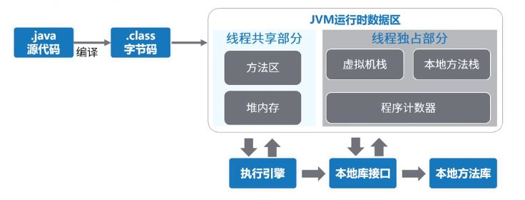
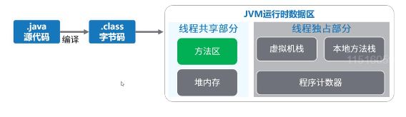
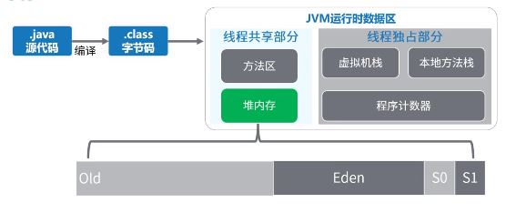
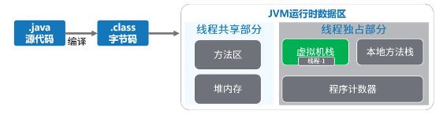
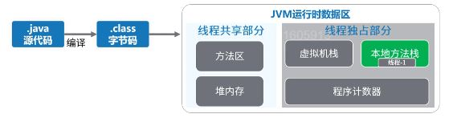
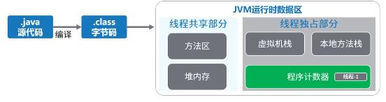
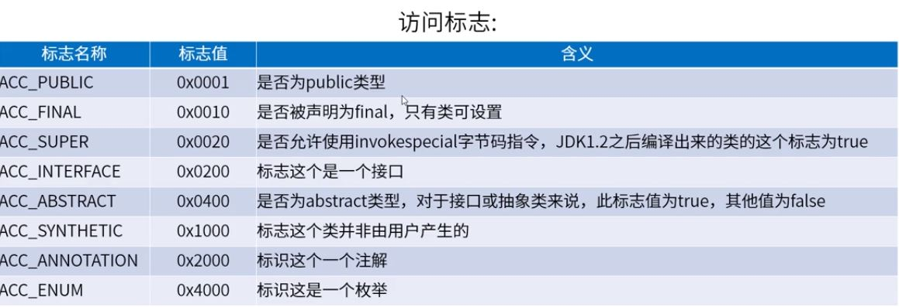
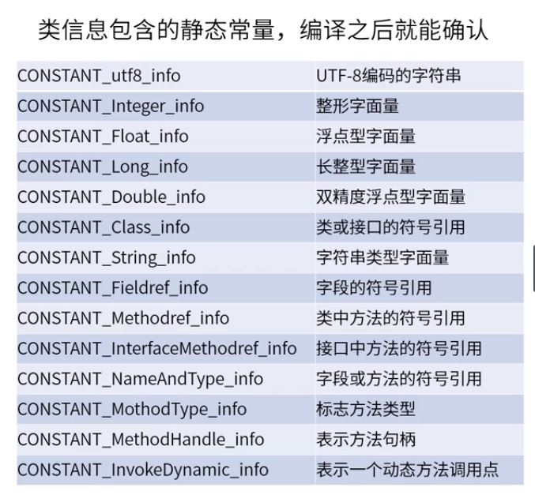
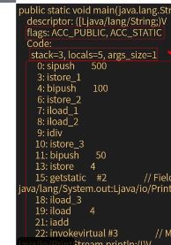

#JAVA程序运行原理分析

##class文件内容

class文件包含java程序执行字节码，数据严格按照紧凑排列在class文件中的二进制流，中间没有任何分隔符；文件开头有一个0xcafebabe（16进制）特殊的一个标志。

##JVM运行时数据区

- 线程独占

每个线程都会有它独立的空间，随线程声明周期而创建和销毁

- 线程共享

所有线程能访问这块内存数据，随虚拟机或者GC而创建和销毁

##方法区

JVM用来存储加载的类信息、常量、静态变量、编译后的代码等数据
虚拟机规范中是一个逻辑区划。具体实现根据不同虚拟机实现。
如：oracle的HotSpot在java7中方法区放在永久代，java8放在元数据空间，并且通过GC机制对这个区域进行管理

##堆内存

**堆内存** 可以细分为：老年代，新生代（Eden,From Survivor,To Survivor）
JVM启动时创建，存放对象的实例。垃圾回收器主要就是管理堆内存。
如果满了，就会出现OutofMemeoryError,详见“内存模型”

##虚拟机栈

**虚拟机栈**，每个线程都在这个空间有一个私有的空间。
线程栈又多个栈帧(Stack Frame)组成。
一个线程会执行一个或多个方法，一个方法对应一个栈帧。
栈帧内容包括：局部变量表、操作数栈、动态链接、方法返回地址、附加信息等。
栈内存默认最大是1M，超出则抛出StackOverflowError

##本地方法栈

和虚拟机栈功能类似，虚拟机栈是为虚拟机执行JAVA方法而准备的，**本地方法栈**是为虚拟机使用Native本地方法准备的。
虚拟机规范没有规定具体的实现，由不同的虚拟机厂商实现。
HotSpot虚拟机中虚拟机栈和本地方法栈的实现是一样的。同样，超出则抛出StackOverflowError。

##程序计数器

**程序计数器**记录当前线程执行字节码的位置，存储的是字节码指令地址，如果执行Native方法，则计数器值为空。
每个线程在这个空间有一个私有的空间，占用内存空间很少。
CPU同一时间，只会执行一条线程中的指令。JVM多线程会轮流切换并分配CPU执行时间的方式。为了线程切换后，需要通过程序计数器，来恢复正确的执行位置。

##查看class文件内容
    //编译
    javac Demo.java
    //javap查看内容
    javap -v Demo.class > Demo.txt
    
- 版本号/访问控制
> 主版本号 jdk5/6/7/8 --> 49/50/51/52，
> 次版本号
> 访问标志

- 常量池

类本身的常量

- 构造方法

**没有定义构造函数使，会有隐式的无参构造函数**

- 程序入口main方法

> flags:ACC_PUBLIC 访问控制 

> stack/local/args_size 本地变量数量/参数数量/方法对应栈帧中操作数栈的深度

> JVM执行引擎去执行源码编译过后的指令码，javap翻译出来的是操作符，class文件存储的是指令码。前面的数字，是偏移量，JVM根据这个区分不同的指令，
详情见
